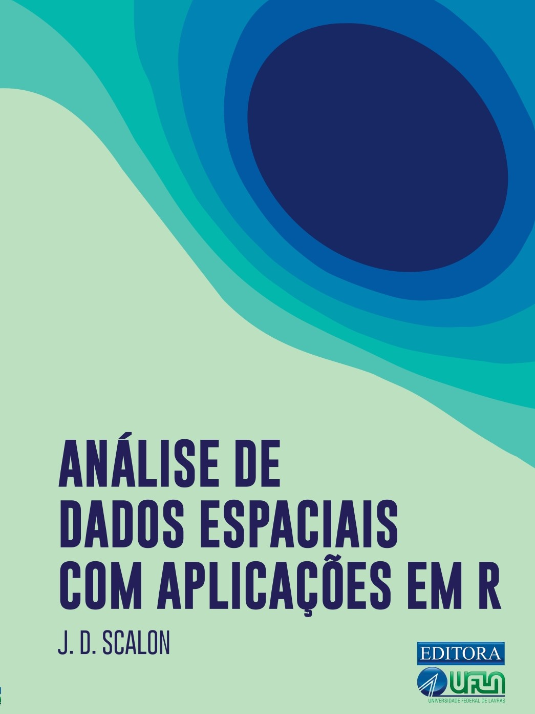

::: {style="display: grid; grid-template-columns: repeat(4, 1fr); row-gap: 15px; column-gap: 20px; align-items: center; justify-items: center; margin-top: 0px;"}

:::

::: {style="display: flex; justify-content: center; margin-top: 10px; margin-bottom: 30px;"}

:::
