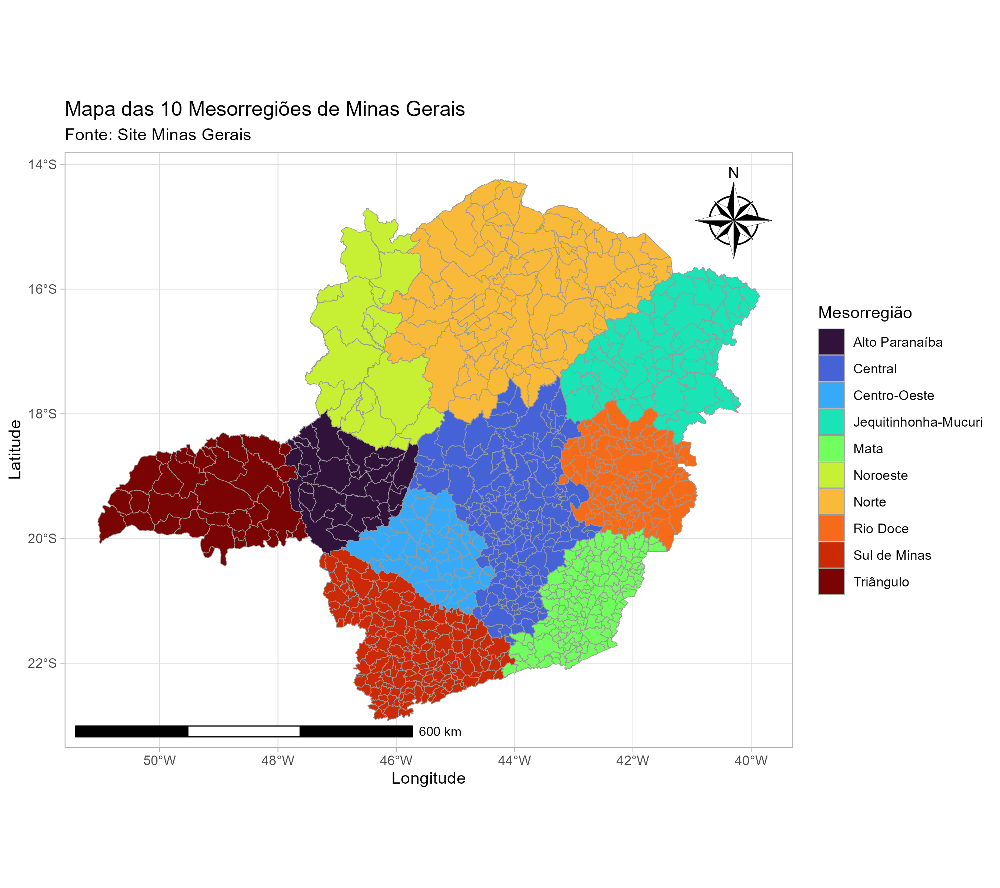
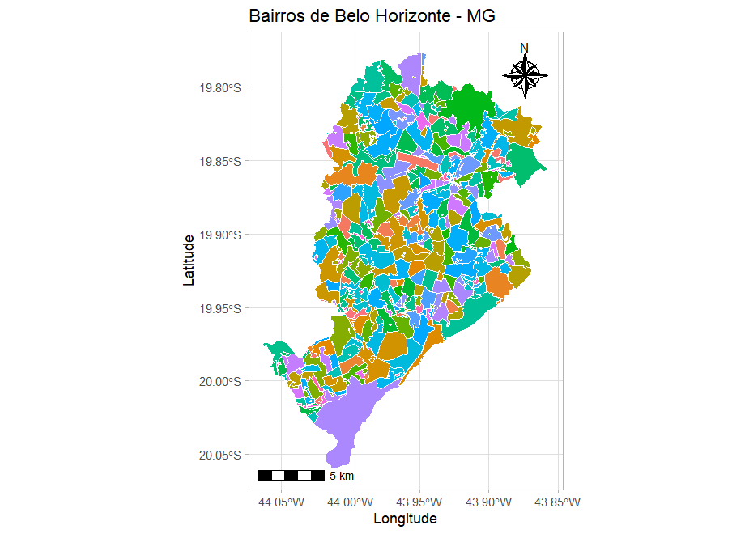
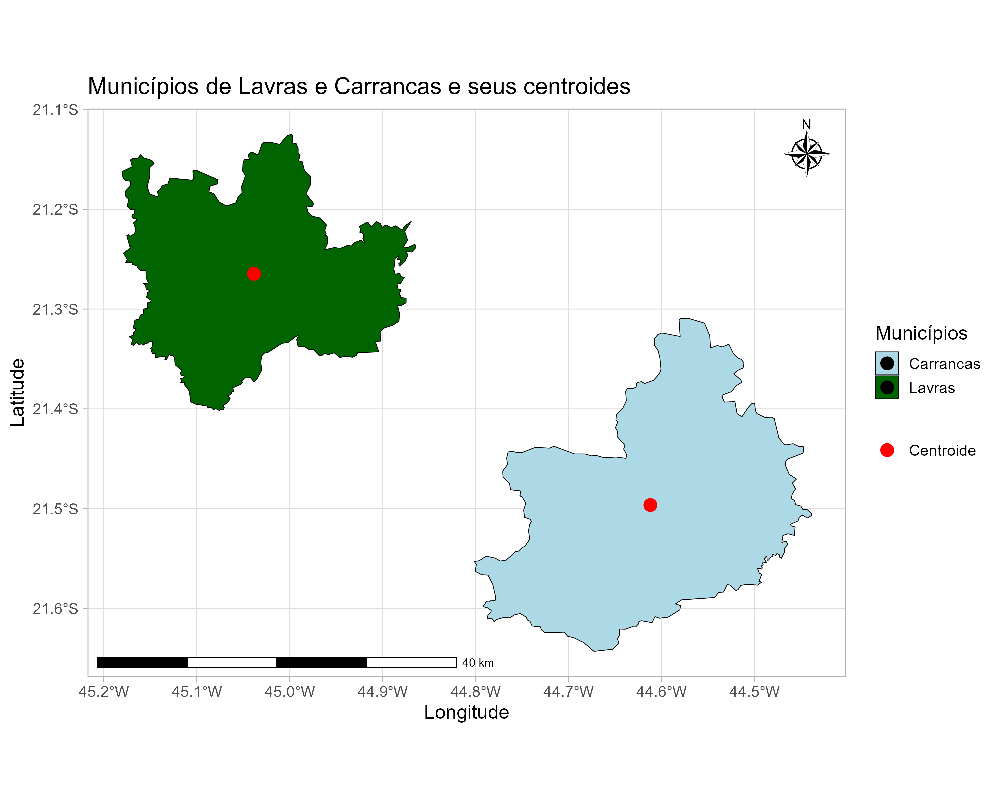
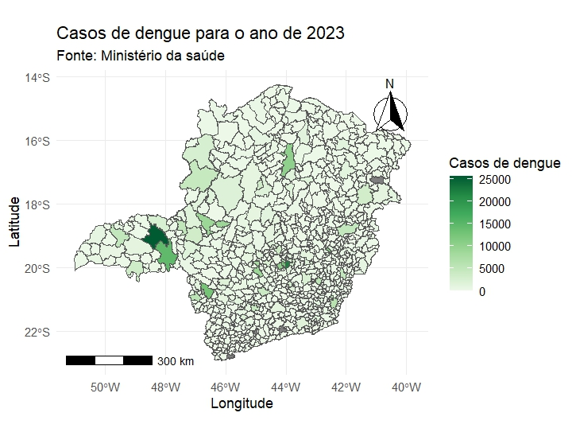
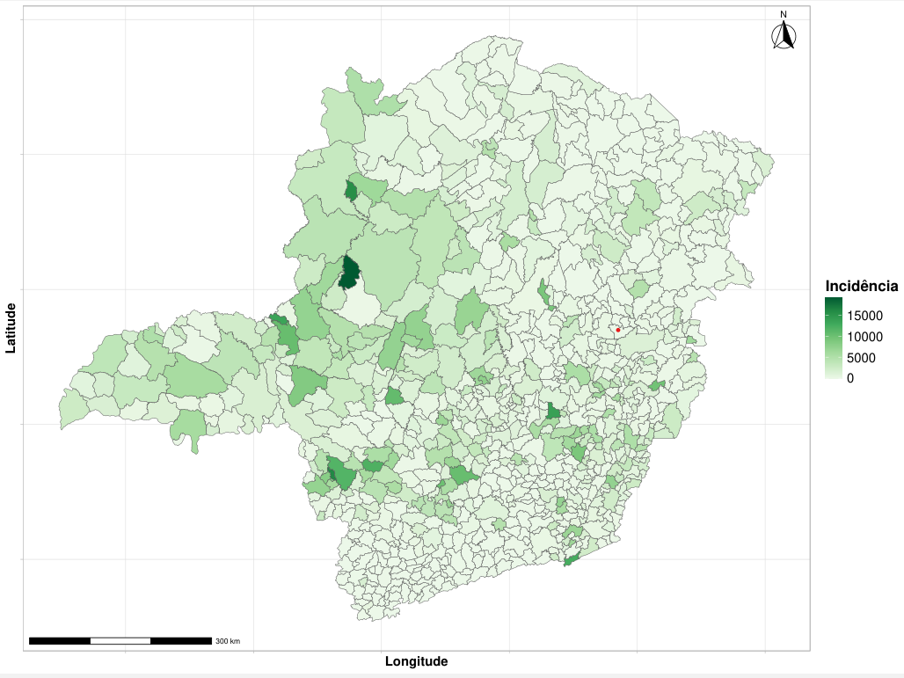
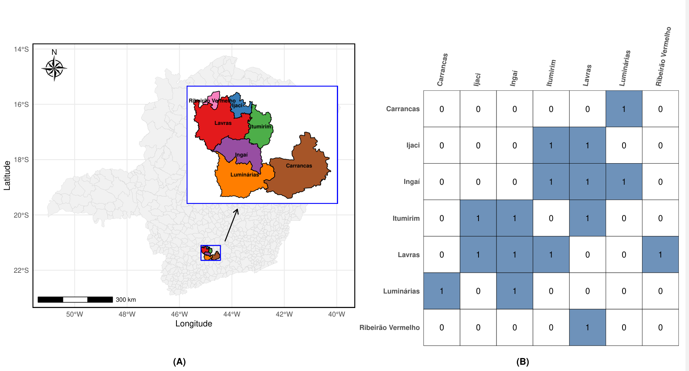
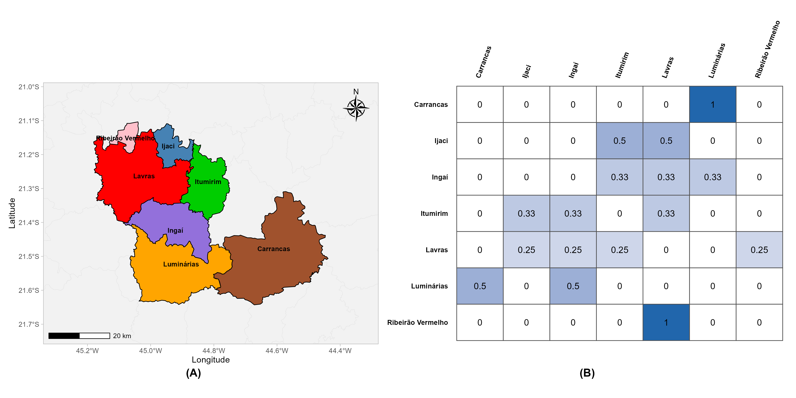
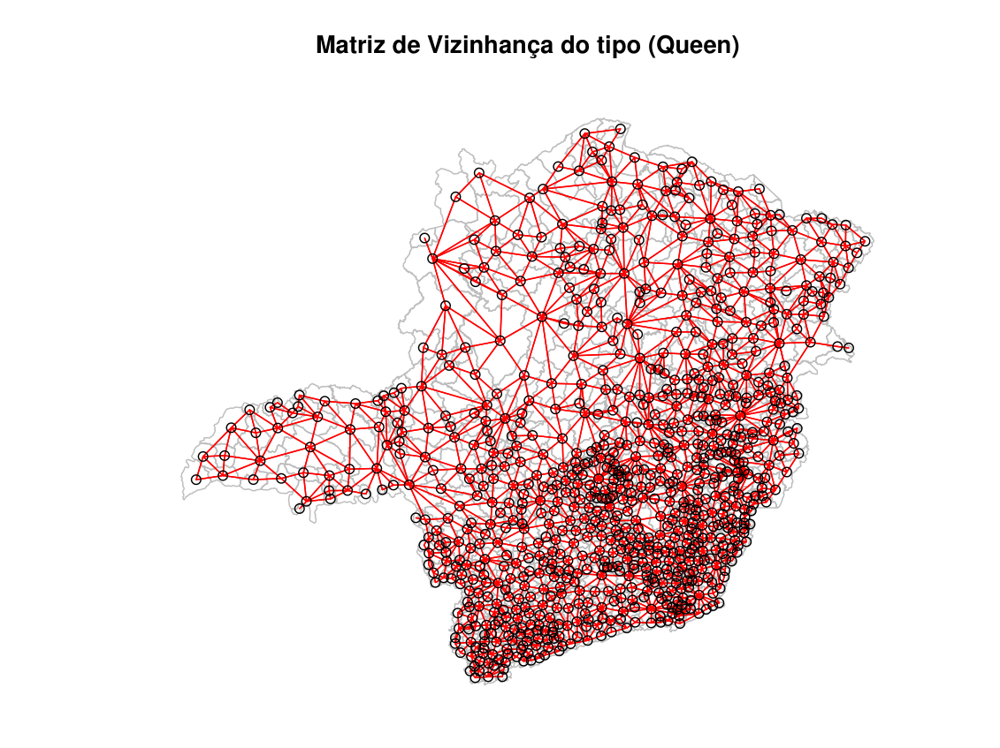
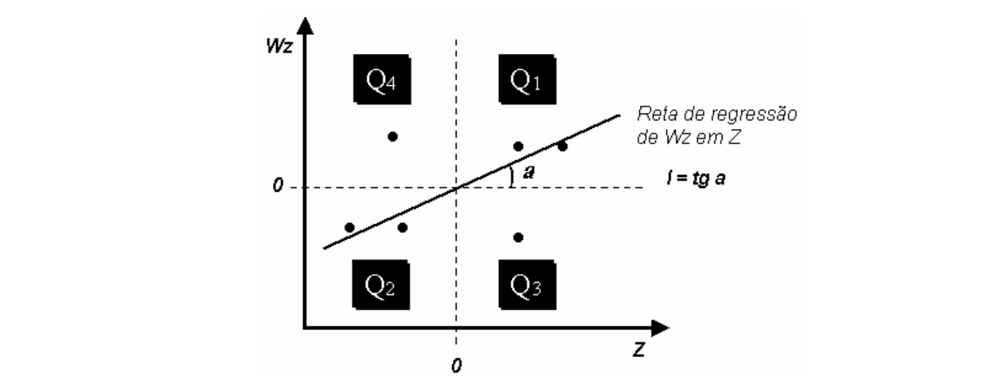

# Introdução à Estatística Espacial

::::: {.columns style="display: flex; align-items: center; background-color: #f0f4f8; border: 2px solid #d1d9e6; border-radius: 15px; padding: 20px; box-shadow: 0 4px 6px rgba(0,0,0,0.1);"}
::: {.column width="50%"}

{alt="" width="300"}
:::

::: {.column width="50%"}
::: {.callout-note title="O que é Estatística Espacial?" style="background-color: #e3f2fd;"}
-   De acordo com @scalon2024, a estatística espacial é um ramo da estatística que se concentra na análise de dados que possuem uma localização, representada por coordenadas geográficas e/ou regiões.

-   Conforme descrito por @scalon2024 o que distingue a estatística espacial da clássica é a necessidade de que os dados possuam localizações geográficas, característica ausente na estatística clássica.
:::
:::
:::::

## Tipos de Dados Espaciais

@cressie1991statistics , @cressie1993statistics , @gatrell1996 e @waller2004 classificam os dados espaciais em diferentes tipos, conforme a natureza da distribuição espacial, em três principais categorias:

::: {.callout-note title="Tipos de Dados Espaciais" style="background-color: #bad9f0;"}
-   Dados de Áreas
-   Dados Pontuais
-   Dados Geoestatísticos
:::

### Definições

::::: {.columns style="display: flex; align-items: center; background-color: #f0f4f8; border: 2px solid #d1d9e6; border-radius: 15px; padding: 20px; box-shadow: 0 4px 6px rgba(0,0,0,0.1);"}

::: {.column width="50%"}
{fig-alt="Mapa ilustrando diferentes tipos de dados espaciais: dados de áreas, dados pontuais e dados geoestatísticos." width="422"}
:::

::: {.column width="50%"}

::: {.callout-note title="Definições dos Tipos de Dados Espaciais [@scalon2024]" style="background-color: #addda9;"}
-   Dados de áreas, também conhecidos como dados de lattice ou dados de superfície discreta, são dados espaciais indexados a sub-regiões que constituem uma partição de um domínio contínuo.

-   Dados pontuais surgem quando as próprias localizações dos eventos são o objeto de interesse.

-   Dados geoestatísticos, também conhecidos como dados de superfícies contínuas.
:::

:::
:::::


## Onde aplicar a estatística espacial?
A estatística espacial é amplamente aplicada em diversas áreas, incluindo:

- **Epidemiologia:** Análise da distribuição espacial de doenças.
- **Ecologia:** Estudo da distribuição de espécies e habitats.
- **Geografia:** Análise de padrões espaciais em fenômenos geográficos.
- **Ciências ambientais:** Monitoramento da qualidade do ar e da água.
- **Planejamento urbano:** Análise de uso do solo e desenvolvimento urbano.
- **Agricultura:** Mapeamento de produtividade e gestão de recursos.
- **Economia:** Análise de mercados imobiliários e padrões econômicos regionais.
- **Ciências sociais:** Estudo de padrões demográficos e sociais.
- **Saúde pública:** Análise de acesso a serviços de saúde e distribuição de recursos.
- **Transportes:** Planejamento de redes de transporte e análise de tráfego.
- **Climatologia:** Estudo de padrões climáticos e mudanças ambientais.
- **Recursos naturais:** Gestão e monitoramento de recursos naturais, como florestas e corpos d'água.
  
e muito mais áreas que envolvem dados geograficamente referenciados.

---

::: {.callout-note title="📌 Introdução" style="background-color:#f3f6fb; border-left: 6px solid #3b82f6;"}
Neste minicurso, vamos explorar as **análises de dados de áreas**, desde os conceitos fundamentais até a aplicação prática de **modelos de regressão espacial**, utilizando o software **R**.

A estrutura foi pensada para construir o conhecimento de forma **gradual, didática e aplicada**.
:::


# O minicurso será organizado nos seguintes tópicos:

::: {.callout-note title="🗂️ Estrutura do Minicurso"
style="background-color:#f8fafc; border-left:6px solid #2563eb;"}

Tópicos:

1. **Fundamentos de dados de Áreas**  
   Introdução aos conceitos básicos, como o que são dados de área e a importância dos centroides.

2. **Dependência espacial**  
   Exploração da dependência espacial, construção da matriz de pesos e métodos para medir a autocorrelação (Índice de Moran).

3. **Modelos de regressão espacial**  
   Apresentação dos modelos SAR e SEM, diagnóstico e critérios de seleção.

4. **Exemplos práticos com Interpretação**  
   Um estudo de caso completo, do tratamento dos dados à visualização e interpretação dos resultados.

5. **Tópicos de sugestão**  
   Sugestões de modelos robustos para lidar com outliers

:::


# Parte: Fundamentos de dados de áreas

## O que são dados de áreas?

Dados de áreas, também conhecidos como dados de *lattice* ou de superfície discreta, referem-se a variáveis aleatórias associadas a áreas contíguas e disjuntas de uma superfície [@scalon2024]. Essas observações são agregadas em unidades espaciais discretas, como bairros, municípios ou regiões administrativas, que são representadas por polígonos em sistemas de informação geográfica (SIG).

::: {.callout-tip title="📌 Estado de Minas Gerais"}
::: {layout-ncol=2 layout-valign="center"}
{#fig-mg-municipios}

{#fig-bh-bairros}
:::
:::

As áreas podem ser regulares ou irregulares. 

Em geral, áreas representadas por regiões geográficas como estados e municípios são denominadas de espacialmente irregulares, enquanto áreas representadas por pixels, como imagens de sensoriamento remoto, são denominadas espacialmente regulares formadas por uma grade de espaços iguais[@scalon2024].

## O Conceito de centroide

Nesta abordagem, modelamos uma variável resposta agregada em polígonos (exemplo: taxas de criminalidade por bairro, incidência de doenças por município e dados socioeconômicos e etc.). Os dados das variáveis aleatórias podem ser de qualquer tipo (contínuas, discretas, etc) e tipicamente, representam toda a área, ou seja, não se dispõe da localização exata dos eventos dentro da área, mas sim de um valor que foi agregado para aquela área. Embora esses dados estejam associados com toda a área, em geral, eles são atribuídos a um ponto específico dentro da área, que geralmente é o centroide da área [@scalon2024].

O **centroide geométrico** é o ponto que representa o centro de massa de uma região plana, assumindo densidade uniforme. Ele corresponde ao ponto de equilíbrio da figura e é amplamente utilizado em análises geométricas e em sistemas de informação geográfica
[@weisstein_geometric_centroid; @bourke_polygon_centroid].

$$
M = \iint \sigma(x,y)\, dA
$$

$$
\bar{x} = \frac{1}{M}\iint x\,\sigma(x,y)\, dA,
\qquad
\bar{y} = \frac{1}{M}\iint y\,\sigma(x,y)\, dA
$$

Para um polígono com vértices
$(x_1,y_1), (x_2,y_2), \ldots, (x_n,y_n)$), o centroide pode ser calculado por
[@bourke_polygon_centroid]:

$$
A =
\frac{1}{2}
\sum_{i=1}^{n}
(x_i y_{i+1} - x_{i+1} y_i)
$$

$$
\bar{x} =
\frac{1}{6A}
\sum_{i=1}^{n}
(x_i + x_{i+1})
(x_i y_{i+1} - x_{i+1} y_i),
\qquad
\bar{y} =
\frac{1}{6A}
\sum_{i=1}^{n}
(y_i + y_{i+1})
(x_i y_{i+1} - x_{i+1} y_i)
$$

$$
x_{n+1} = x_1,
\qquad
y_{n+1} = y_1
$$

No R, o pacote `sf` nos oferece uma função pronta para este cálculo:
```{r, eval=FALSE, echo=TRUE}
#| code-fold: true
#| code-summary: "Código R para calcular centroides"
# Carrega o pacote
library(sf)

# Calcula o centroide de um objeto sf
st_centroid(objeto_sf)
```

A @fig-centroides ilustra o conceito, mostrando os polígonos dos municípios de Lavras e Carrancas (MG) e seus respectivos centroides calculados.

::: {.callout-tip title="📌 Centroide de dois municípios em Minas Gerais - MG"}
{#fig-centroides fig-align="center" width=60%}
:::

```{r}
#| message: false
#| warning: false
#| echo: false
#| fig-align: center
# crie um centroide de exemplo de um dado de area em R, um exemplo qualquer
# library(sf)
# library(geobr)
# library(ggplot2)
# library(ggspatial)
# --- Exemplo com dados reais (Lavras e Carrancas - MG) ---

# Obter os shapefiles dos municípios
# Lavras (código IBGE: 3138203) e Carrancas (código IBGE: 3114600)
# lavras <- read_municipality(code_muni = 3138203, year = 2020)
# carrancas <- read_municipality(code_muni = 3114600, year = 2020)

# Para plotar os dois juntos, podemos combiná-los em um único objeto sf
# dois_municipios <- rbind(lavras, carrancas)

# Calcular os centroides
# centroides <- st_centroid(dois_municipios)

# --- Visualização elegante com ggplot2 ---
# mapa_centroides <- ggplot() +
# Camada 1: Polígonos dos municípios
#  geom_sf(data = dois_municipios, aes(fill = name_muni), color = "black") +

# Camada 2: Pontos dos centroides
# Mapeamos a cor para uma string para que ela apareça na legenda
#  geom_sf(data = centroides, aes(color = "Centroide"), size = 4, show.legend = "point") +

# Personalização das cores e legendas
#  scale_fill_manual(
#    name = "Municípios",
#    values = c("Lavras" = "darkgreen", "Carrancas" = "lightblue")
#  ) +
#  scale_color_manual(
#    name = NULL, # Remove o título da legenda do centroide
#    values = c("Centroide" = "red")
#  ) +

# Rótulos, título e tema
#  labs(
#    title = "Municípios de Lavras e Carrancas e seus centroides",
#    x = "Longitude",
#    y = "Latitude"
#  ) +
#  theme_light(base_size = 14) +
#  annotation_scale(location = "bl", width_hint = 0.5) +
#  annotation_north_arrow(location = "tr",
# 						 style = north_arrow_nautical())

# Salvar o gráfico no diretório especificado
# ggsave(
#  filename = "C:/Meus_documentos/Minicurso_peru_2026/Livros/mapa_centroides.png",
#  plot = mapa_centroides,
#  width = 10,
#  height = 8,
#  dpi = 300
# )

# Exibe o gráfico no documento
# mapa_centroides
```

::: {.callout-important title="🎯 Objetivo da análise de dados de áreas" style="background-color: #ebf3f9;"}
O objetivo da análise de dados de áreas é o mesmo da análise dos outros tipos de dados espaciais, ou seja, caracterizar o processo estocástico que gerou os dados [@scalon2024].
:::

Na análise de dados de áreas, como existe apenas um valor $z_i$ para a área $W_i$, deve-se assumir algum tipo de estacionariedade e para alguns casos será necessário assumir a normalidade multivariada [@scalon2024]. 

Para esse tipo de análise de dados espaciais, pode-se estar interessado em um ou mais objetivos.
Por exemplo, @scalon2024 cita alguns dos objetivos, que podem ser:  

-   Explorar o comportamento das variáveis aleatórias na região de estudo;
     - o principal objetivo é entender a distribuição espacial da variavel de estudo se comportam, verificar se precisa de transformação, identificar possíveis outliers espaciais, entre outros.  
-   Obter mapas mais suaves do que o mapa dos dados observados;
     - o objetivo aqui é caracterizar os efeitos de primeira ordem do processo estocástico espacial que gerou os dados, ou seja, estimar a média global (ou local) do processo estocastico. 
-   etc...
-   Na p.176 do livro de @scalon2024, são listados outros objetivos e mais referências para consulta.

## Visualização de Dados Espaciais

::: {.callout-tip title="📌 Estado de Minas Gerais"}
::: {layout-ncol=2 layout-valign="center"}
{#fig-mg-dengue}

{#fig-mg-incidencia}
:::
:::

# Parte: Dependência espacial

## A Matriz de Pesos Espaciais (W)

Para analisar dados de áreas, é necessário definir uma matriz de vizinhança espacial $W = [W_{ij}]$, que descreve a relação espacial entre as áreas. A matriz $W$ é uma matriz quadrada de ordem $n \times n$, onde $n$ é o número de áreas na região de estudo. Cada elemento $W_{ij}$ da matriz representa a proximidade ou peso entre as áreas $i$ e $j$. A definição dos pesos pode variar dependendo do contexto e do objetivo da análise. A escolha da matriz é arbitrária, mas deve refletir a estrutura espacial dos dados e o fenômeno em estudo [@scalon2024]. Uma das escolhas mais comuns para definir a matriz de pesos é a matriz binária de contiguidade, onde $W_{ij} = 1$ se as áreas $i$ e $j$ são vizinhas (compartilham uma fronteira comum) e $W_{ij} = 0$ caso contrário.

### Matriz de contiguidade espacial

A matriz de contiguidade expressa formalmente a estrutura espacial resultante, onde cada unidade espacial é representada tanto como uma linha quanto como uma coluna. Em cada linha, os elementos de coluna não nulos correspondem às unidades espaciais contíguas, refletindo as interações espaciais entre elas. Por convenção, uma célula não é contígua a si mesma, resultando em elementos diagonais zero [@anselin1988spatial].

Essa matriz é uma ferramenta fundamental para caracterizar a dependência espacial e é amplamente utilizada na análise de dados espaciais de área, ajudando a identificar padrões de vizinhança e autocorrelação espacial, elementos essenciais para compreender as dinâmicas espaciais e aprimorar a interpretação dos dados, como detalhado por @anselin1988spatial.

Matrizes de contiguidade, como apresentadas na Figura @fig-contiguity_matr, ilustram como a estrutura espacial é representada nas unidades de uma rede regular, evidenciando as interações espaciais entre as áreas. A Figura @fig-contiguity_matr exibe a matriz de contiguidade detalhada por @anselin1988spatial, permitindo visualizar as relações de vizinhança entre as unidades espaciais.

```{r}
#| label: fig-contiguity_matr
#| engine: tikz
#| echo: false
#| fig-cap: "Tipos de vizinhança espacial."
#| fig-align: center

\begin{tikzpicture}[scale=0.7, every node/.style={minimum size=0.8cm, align=center}]
			
			% --- Função para desenhar a grade 5x5 com linhas em negrito ---
			\newcommand{\grade}{
				% Linhas verticais
				\foreach \x in {0,...,5} \draw[ultra thick] (\x,0) -- (\x,5);
				% Linhas horizontais
				\foreach \y in {0,...,5} \draw[ultra thick] (0,\y) -- (5,\y);
			}
			
			% --- 1. Common Edge ---
			\begin{scope}[shift={(0,8)}]
				\grade
				\node at (2.5,1.5) {\textbf{b}};
				\node at (2.5,3.5) {\textbf{b}};
				\node at (1.5,2.5) {\textbf{b}};
				\node at (3.5,2.5) {\textbf{b}};
				\node at (2.5,2.5) {\textbf{a}};
				\node[draw=none] at (2.5,-1) {\textbf{Borda comum}};
			\end{scope}
			
			% --- 2. Common Vertex ---
			\begin{scope}[shift={(8,8)}]
				\grade
				\node at (1.5,1.5) {\textbf{c}};
				\node at (1.5,3.5) {\textbf{c}};
				\node at (3.5,1.5) {\textbf{c}};
				\node at (3.5,3.5) {\textbf{c}};
				\node at (2.5,2.5) {\textbf{a}};
				\node[draw=none] at (2.5,-1) {\textbf{Vértice comum}};
			\end{scope}
			
			% --- 3. Radius ---
			\begin{scope}[shift={(0,0)}]
				\grade
				\node at (2.5,2.5) {\textbf{A}};
				\node at (2.5,1.5) {\textbf{B}};
				\node at (2.5,3.5) {\textbf{B}};
				\node at (1.5,2.5) {\textbf{B}};
				\node at (3.5,2.5) {\textbf{B}};
				% Dots on the circle
				\fill (2.5, 3.8) circle (2pt) node[above] {\tiny\textbf{}};
				\fill (2.5, 1.2) circle (2pt) node[below] {\tiny\textbf{}};
				\fill (1.2, 2.5) circle (2pt) node[left] {\tiny\textbf{}};
				\fill (3.8, 2.5) circle (2pt) node[right] {\tiny\textbf{}};
				\fill (1.5, 3.5) circle (2pt) node[above left] {\tiny\textbf{}};
				\fill (3.5, 3.5) circle (2pt) node[above right] {\tiny\textbf{}};
				\fill (1.5, 1.5) circle (2pt) node[below left] {\tiny\textbf{}};
				\fill (3.5, 1.5) circle (2pt) node[below right] {\tiny\textbf{}};
				\draw[dotted, ultra thick] (2.5,2.5) circle (1.3);
				\node[draw=none] at (2.5,-1) {\textbf{Raio}};
			\end{scope}
			
			% --- 4. Second Order ---
			\begin{scope}[shift={(8,0)}]
				\grade
				\node at (2.5,4.5) {\textbf{d}};
				\node at (2.5,0.5) {\textbf{d}};
				\node at (0.5,2.5) {\textbf{d}};
				\node at (4.5,2.5) {\textbf{d}};
				\node at (1.5,3.5) {\textbf{c}};
				\node at (3.5,3.5) {\textbf{c}};
				\node at (1.5,1.5) {\textbf{c}};
				\node at (3.5,1.5) {\textbf{c}};
				\node at (2.5,3.5) {\textbf{b}};
				\node at (2.5,1.5) {\textbf{b}};
				\node at (1.5,2.5) {\textbf{b}};
				\node at (3.5,2.5) {\textbf{b}};
				\node at (2.5,2.5) {\textbf{a}};
				\node[draw=none] at (2.5,-1) {\textbf{Segunda ordem}};
			\end{scope}
			
\end{tikzpicture}
```

Fonte: @anselin1988spatial

Como mostrado na @fig-contiguity_matr, a matriz de contiguidade ilustra a estrutura espacial das unidades geográficas, sendo um dos elementos-chave para a análise de dados espaciais [@anselin1988spatial]. A escolha dessa matriz é fundamental, pois ela determina o tipo de vizinhança a ser considerada, influenciando diretamente os resultados da análise espacial. Dependendo da configuração da matriz de contiguidade, diferentes padrões de interação espacial entre as unidades de análise são destacados, o que pode alterar a interpretação dos dados e os resultados modelados.

De acordo com @anselin1988spatial, a matriz de contiguidade para áreas irregulares pode ser representada a seguir:

$$
w_{ij} =
\begin{cases}
1 & \text{se a área } i \text{ e a área } j \text{ são vizinhas}, \\
0 & \text{caso contrário},
\end{cases}
$$

\noindent em que convenciona-se que $c_{ii} = 0$ para todo $i$ [@cressie1991statistics].

A Figura @fig-matriz_w_geral apresenta a estrutura da matriz binária utilizada para representar áreas irregulares.

```{r}
#| label: fig-matriz_w_geral
#| engine: tikz
#| echo: false
#| fig-cap: "Representação genérica de uma matriz de pesos espaciais $C$ de ordem $n \\times n$."
#| fig-align: center

\usetikzlibrary{matrix, positioning}
\begin{tikzpicture}[font=\small]
		
		% 1. AUMENTAR ESPAÇO INTERNO DA MATRIZ
		% mudei row sep e column sep de 0.1cm para 0.5cm
		\matrix (M) [matrix of math nodes,
		left delimiter={[},
		right delimiter={]},
		nodes={minimum width=3.5em, minimum height=2.5em, anchor=center}, % Células maiores
		row sep=0.4cm, column sep=0.4cm]
		{
			0      & w_{12} & w_{13} & \dots  & w_{1n} \\
			w_{21} & 0      & w_{23} & \dots  & w_{2n} \\
			w_{31} & w_{32} & 0      & \dots  & w_{3n} \\
			\vdots & \vdots & \vdots & \ddots & \vdots \\
			w_{n1} & w_{n2} & w_{n3} & \dots  & 0      \\
		};
		
		% Rótulo da variável W (Afastado para esquerda)
		\node[left=1.8cm of M] {\Large $C =$};
		
		% Rótulos das colunas (1, 2, 3... n)
		\foreach \col/\name in {
			1/1,
			2/2,
			3/3,
			4/\dots,
			5/n
		} {
			% 2. AFASTAR NÚMEROS DAS COLUNAS (mudei de 0.1cm para 0.3cm)
			\node[above=0.3cm of M-1-\col, anchor=south] {$\name$};
		}
		
		% Título "Áreas (j)" (Afastado mais para cima)
		% 3. AFASTAR TÍTULO SUPERIOR (mudei de 0.6cm para 1.0cm)
		\node[above=1.0cm of M-1-3] {\textbf{Áreas ($j$)}};
		
		% Rótulos das linhas (1, 2, 3... n)
		\foreach \row/\name in {
			1/1,
			2/2,
			3/3,
			4/\vdots,
			5/n
		} {
			% 2. AFASTAR NÚMEROS DAS LINHAS (mudei de 0.1cm para 0.3cm)
			\node[left=0.3cm of M-\row-1, anchor=east] {$\name$};
		}
		
		% Título "Áreas (i)" (Afastado mais para a esquerda)
		% 3. AFASTAR TÍTULO LATERAL (mudei de 0.8cm para 1.4cm)
		\node[left=1.4cm of M-3-1, rotate=90, anchor=south] {\textbf{Áreas ($i$)}};
		
\end{tikzpicture}
```

Fonte: Autor (2025).


De acordo com @anselin1988spatial, o uso de uma matriz de pesos espaciais tem como objetivo principal relacionar os valores de uma variável observada em um ponto específico do espaço com os valores dessa variável em outras unidades espaciais ao redor. Esse tipo de relação é essencial para a modelagem de dependência espacial, onde a proximidade geográfica entre as unidades influencia a variável de interesse, permitindo uma compreensão das interações espaciais. Esse conceito de dependência espacial está diretamente relacionado à autocorrelação espacial, que será discutida a seguir.


### Matriz de proximidade espacial binária

{
  width="800"
  height="400"
  fig-align="center"
}

Conforme discutido por @scalon2024, é recomendável padronizar a matriz de pesos espaciais $\mathbf{W}$ de modo que a soma dos pesos em cada linha seja igual a 1. Essa padronização permite interpretar os pesos espaciais como **proporções**, além de facilitar a comparação entre diferentes unidades espaciais, especialmente quando o número de vizinhos varia entre as áreas.

A matriz de contiguidade binária $\mathbf{W}$ é definida a partir da relação de vizinhança entre as áreas, assumindo valor $1$ quando as áreas $i$ e $j$ são vizinhas e $0$ caso contrário.

---

### Padronização da matriz de pesos espaciais

A padronização nas linhas da matriz de pesos espaciais segue a seguinte estrutura:

$$
w_{ij}^{(W)} =
\begin{cases}
\dfrac{w_{ij}}{\sum_{j=1}^{n} w_{ij}}, & \text{se } \sum_{j=1}^{n} w_{ij} > 0, \\
0, & \text{caso contrário}.
\end{cases}
$$

De forma matricial, a padronização pode ser expressa como:

$$
\mathbf{W}^{(W)} = \mathbf{D}^{-1}\mathbf{W},
$$

em que $\mathbf{D}$ é uma matriz diagonal cujos elementos  
$d_{ii} = \sum_{j=1}^{n} w_{ij}$ representam o número de vizinhos da área $i$.

No pacote **spdep**, essa padronização corresponde à opção `style = "W"` na função `nb2mat()`.

---

### Matriz de pesos espaciais padronizada nas linhas

{
  width="800"
  height="400"
  fig-align="center"
}

A figura acima apresenta a matriz de pesos espaciais padronizada nas linhas, obtida a partir da matriz de contiguidade binária. Nessa representação, cada elemento indica a **influência relativa** de uma área vizinha sobre a área de referência, respeitando a condição de soma unitária em cada linha.

---

### Matriz de vizinhança do tipo *Queen*

{
  fig-align="center"
}

Na vizinhança do tipo *Queen*, duas áreas são consideradas vizinhas quando compartilham **qualquer ponto de fronteira**, seja um lado ou um vértice, resultando em uma estrutura de dependência espacial mais abrangente quando comparada à vizinhança do tipo *Rook*.


### Autocorrelação espacial

A autocorrelação espacial é uma medida que indica o grau de similaridade ou dissimilaridade de uma mesma variável no espaço. A ideia básica da autocorrelação espacial é determinar um indicador que mede a relação de uma determinada variável no espaço, ou seja, como essa variável se comporta numa determinada região geográfica [@manuel2011].

Os primeiros passos para a autocorrelação espacial *(spatial autocorrelation)* foram abordados por Moran (1948) e Geary (1954) que desenvolveram suas medidas de autocorrelação espacial [@anselin1988spatial].

Para @anselin1988spatial, o problema da unidade de área modificável está relacionado à influência da definição das unidades espaciais sobre os resultados estatísticos em análises de dados geográficos. Esse problema pode impactar a interpretação da autocorrelação espacial, uma vez que medidas como o índice global e local de Moran, o índice de Geary e o variograma são sensíveis à maneira como as unidades espaciais são organizadas.

Conforme @druck2004analise, a autocorrelação espacial pode ser medida por meio de diversos índices, como o Índice global e local de Moran, o índice de Geary e o variograma. Dentre esses indicadores, o Índice de Moran é o mais amplamente utilizado em análises de dados de áreas, pois oferece uma maneira robusta de quantificar a dependência espacial global, ou seja, a relação entre os valores observados em diferentes unidades espaciais. Esse índice é fundamental para a detecção de padrões espaciais e é apresentado a seguir.

## Índice de Moran global ($I$)

Conforme @waller2004, os índices globais de autocorrelação espacial, como o Índice de Moran ($I$) , calculam a similaridade entre as regiões $i$ e $j$ com base no produto das diferenças entre os valores $Y_i$ e $Y_j$, em relação à média global da variável aleatória $Y$. Este índice é amplamente utilizado para medir a autocorrelação espacial global, permitindo identificar padrões de agrupamento ou dispersão em dados de área. O Índice de Moran é essencial para entender como os valores observados em uma área estão relacionados com os valores em áreas vizinhas, fornecendo uma visão sobre a estrutura espacial dos dados.

A estatística do índice de Moran, conforme apresentada por @Bivand2008, é estimada da seguinte forma:

$$
\hat{I} =
\dfrac{n}{\displaystyle \sum_{i=1}^{n} \sum_{j=1}^{n} W_{ij}} \,
\dfrac{\displaystyle \sum_{i=1}^{n} \sum_{j=1}^{n} W_{ij} (Y_i - \bar{Y})(Y_j - \bar{Y})}
{\displaystyle \sum_{i=1}^{n} (Y_i - \bar{Y})^2}
$$ {#eq-moran}

em que:

- $W_{ij}$: elemento da matriz de proximidade espacial entre os locais $i$ e $j$,
- $Y_{i}$: é a variável aleatória na área $i$,
- $Y_{j}$: é a variável aleatória na área $j$,
- $\bar{Y}$: valor médio amostral da variável aleatória em toda a região, dado por $\bar{Y} =  \sum_{i=1}^{n}Y_i/n$ sobre todos os $n$ locais de observação,
- $n$: número total de locais de observação.

O Índice de Moran ($I$) é uma estatística que varia, na maioria dos casos, entre **-1** e **1**, sendo que valores próximos de **1** indicam forte autocorrelação espacial positiva, ou seja, unidades geográficas vizinhas tendem a apresentar valores semelhantes. Valores próximos de **-1** indicam autocorrelação espacial negativa extrema, refletindo uma tendência de que áreas próximas apresentem valores contrastantes. Já valores de $I$ próximos de zero sugerem ausência de autocorrelação espacial, indicando uma distribuição aleatória dos dados no espaço. Essa estatística assume valores no conjunto dos números reais $\mathbb{R}$ e é amplamente utilizada para identificar padrões espaciais em fenômenos geográficos [@scalon2024].

## Índice de Moran Local ($LISA$)

O Índice de Moran Local (LISA) foi desenvolvido como uma estatística para analisar a autocorrelação espacial em nível local e identificar unidades espaciais que exercem influência sobre o Índice de Moran Global (I), para cada área $i$ do estudo [@luzardo2017analise].

De acordo com @scalon2024, o estimador do índice local de autocorrelação espacial de Moran na *i*-ésima área ($\hat{I}_i$) é definido como:

$$
\hat{I}_i =
\dfrac{(Y_i - \bar{Y}) \displaystyle \sum_{j=1}^{n} W_{ij} (Y_j - \bar{Y})}
{\displaystyle \sum_{j=1}^{n} (Y_j - \bar{Y})^2}
$$ {#eq-estimad}

em que:

- $Y_i$ é o valor da variável aleatória na área $i$;
- $Y_j$ é o valor da variável aleatória na área $j$;
- $\bar{Y}$ é o valor da média amostral da variável aleatória em toda a região ($\bar{Y} = \frac{1}{n} \sum_{i=1}^{n} Y_i$)
- $W_{ij}$ são os elementos da matriz de pesos espaciais, normalizados por linha.

A interpretação da equação de (@eq-estimad) é análoga à interpretação do índice global de Moran.  Isso indica que o Índice de Moran Local ($I_i$) é útil para avaliar a homogeneidade ou a diversidade dos dados localmente conforme mencionado por @luzardo2017analise.

Complementando essa análise, @manuel2011 destaca que o “LISA” permite verificar a similaridade ou dissimilaridade dos valores de algumas observações em relação às suas observações vizinhas. Essa medida local oferece uma visão detalhada dos padrões espaciais, revelando como as características das áreas analisadas se relacionam com as regiões ao seu redor.

### Diagrama de Espalhamento de Moran

O Diagrama de Espalhamento de Moran, conforme descrito por @marques2009aplicaccoes, é uma ferramenta gráfica útil para visualizar o comportamento dos dados. Nesse diagrama, os valores dos desvios dos atributos em relação à média (Z) são representados no eixo X (abcissas), enquanto o valor da média dos vizinhos (WZ) está associado ao eixo Y (ordenadas), proporcionando uma representação clara das relações espaciais entre as unidades de análise, conforme mostra a Figura @fig-contiguity_matrix.

{#fig-contiguity_matrix width=80%}

Fonte: @marques2009aplicaccoes

Conforme @marques2009aplicaccoes, a interpretação do diagrama da Figura @fig-contiguity_matrix pode ser feita da seguinte forma:

- Q1 (valores [+], médias [+]) e Q2 (valores [-], médias [-]) indicam pontos de associação espacial positiva, no sentido que uma localização possui vizinhos com valores similares.
- Q3 (val. [+], médias [-]) e Q4 (val. [-], médias [+]) indicam pontos de associação espacial negativa, no sentido que uma localização possui vizinhos com valores dissimilares.

Cabe aqui salientar que os pontos localizados em Q3 e Q4 podem ser vistos como extremos, tanto por estar afastados da reta de regressão linear, como por indicar regiões que não seguem o mesmo processo de dependência espacial das demais observações. Estes pontos marcam regiões de transição entre regimes espaciais distintos [@marques2009aplicaccoes].

## Indice global de Geary

O índice de Geary é uma medida de autocorrelação espacial que avalia a similaridade entre valores observados em áreas vizinhas, enfatizando as diferenças locais. Diferentemente do Índice de Moran, que foca na covariância global, o índice de Geary concentra-se nas variações entre unidades espaciais adjacentes, tornando-o sensível a mudanças abruptas nos dados espaciais [@scalon2024].

O estimador do índice de Geary é definido por:
$$
\hat{G} = \dfrac{(n-1)}{2 \sum_{i=1}^{n} \sum_{j=1}^{n} W_{ij}} \dfrac{\sum_{i=1}^{n} \sum_{j=1}^{n} W_{ij}(Y_i - Y_j)^2}{\sum_{i=1}^{n}(Y_i - \bar{Y})^2}
$$

## Correlogramas 

Os correlogramas espaciais são representações gráficas que ilustram a autocorrelação espacial de uma variável em diferentes distâncias ou ordens de vizinhança. Eles são úteis para identificar padrões espaciais e a extensão da dependência espacial nos dados. Conforme @scalon2024, os correlogramas podem ser construídos utilizando índices como o Índice de Moran ou o índice de Geary, plotando esses valores em função da distância entre as unidades espaciais ou da ordem de vizinhança.

$$
I^{(d)} = \dfrac{n}{\sum_{i=1}^{n} \sum_{j=1}^{n} W_{ij}(d)} \dfrac{\sum_{i=1}^{n} \sum_{j=1}^{n} W_{ij}(d) (Y_i - \bar{Y})(Y_j - \bar{Y})}{\sum_{i=1}^{n} (Y_i - \bar{Y})^2}
$$


```{r}
#| echo: false
#| eval: false
#| label: fig-correlograma-ic
#| fig-cap: "Correlograma espacial ilustrativo baseado no Índice de Moran, com intervalos de confiança."
#| fig-align: center
#| warning: false
#| message: false
library(ggplot2)

# ---------------------------------------------------------
# Dados simulados do correlograma
# ---------------------------------------------------------
correlograma <- data.frame(
    ordem = factor(1:6),
    moran_I = c(0.45, 0.32, 0.18, 0.05, -0.04, -0.10),
    ic_inf = c(0.30, 0.18, 0.05, -0.08, -0.15, -0.22),
    ic_sup = c(0.60, 0.46, 0.31, 0.18, 0.07, 0.02)
)

# ---------------------------------------------------------
# Correlograma: pontos + intervalos de confiança
# ---------------------------------------------------------
ggplot(correlograma, aes(x = ordem, y = moran_I)) +

    # Linha de referência (I = 0)
    geom_hline(yintercept = 0, linetype = "dashed", color = "grey40") +

    # Intervalos de confiança
    geom_errorbar(
        aes(ymin = ic_inf, ymax = ic_sup),
        width = 0.15,
        linewidth = 0.8,
        color = "black"
    ) +

    # Pontos do Índice de Moran
    geom_point(
        size = 3,
        shape = 16,
        color = "#2166AC"
    ) +
    labs(
        x = "Ordem de vizinhança (lag)",
        y = "Índice de Moran"
    ) +
    theme_light(base_size = 12)
```

O correlograma espacial apresenta os valores do Índice de Moran em função da ordem de vizinhança. Observa-se autocorrelação espacial positiva nas primeiras ordens, indicando similaridade entre unidades espaciais próximas. À medida que a ordem de vizinhança aumenta, os valores do índice tendem a se aproximar de zero ou tornar-se negativos, sugerindo enfraquecimento da dependência espacial com o aumento da distância.

# Parte: Modelos de Regressão Espacial

-   O modelo espacial autoregressivo (SAR) é descrito conforme @anselin1988spatial

$$
Y = \rho WY + X\beta + \epsilon
$$ {#eq-sar}

-   Onde

-   $Y$ é um vetor de observações ( n $\times$ 1 ) nas n áreas

-   $X$ é a matriz das variáveis independentes, de tamanho ( n $\times$ i ),

-   $\rho$ é o coeficiente de defasagem da variável dependente espacial,

-   $\beta$ é o vetor de parâmetros da regressão, de tamanho ( i $\times$ 1 ),

-   $W$ é a matriz de ponderação, de tamanho ( n $\times$ n ),

-   $\epsilon$ é o vetor de erros, de tamanho ( n $\times$ 1 ) não correlacionados que seguem uma distribuição normal com média zero e variância constante, isto é, $\epsilon \sim N(0, I\sigma^2$)

#### Propriedades do Modelo SAR

**Esperança (Média Condicional)**

A média condicional da variável resposta $y$, dado os regressores $X$, depende da estrutura de vizinhança $W$ e do parâmetro autorregressivo $\rho$:

$$
E[y|X] = (I_n - \rho W)^{-1}X\beta
$$

**Variância (Matriz de Covariância Condicional)**

A dispersão dos dados é afetada pela dependência espacial, resultando em uma matriz densa:

$$
\Sigma_{y|X} = \sigma^2(I_n - \rho W)^{-1}[(I_n - \rho W)^{-1}]^T
$$

**Log-Verossimilhança (Log-Likelihood)**

Para estimar os parâmetros $\theta = (\rho, \beta, \sigma^2)$ via Máxima Verossimilhança, maximiza-se a seguinte função:

$$
\ln L(\rho, \beta, \sigma^2) = -\frac{n}{2}\ln(2\pi) - \frac{n}{2}\ln(\sigma^2) + \ln|I_n - \rho W| - \frac{1}{2\sigma^2} \left\{ (I_n - \rho W)y - X\beta \right\}^T \left\{ (I_n - \rho W)y - X\beta \right\}
$$

## Modelo de Erro Espacial (Spatial Error Model - SEM)

O modelo CAR considera que os efeitos espaciais são ruídos ou perturbações, ou seja, um termo que precisa ser removido. A especificação CAR baseia-se na distribuição condicional dos termos de erro espacial [@Bivand2008] .

O modelo de erro espacial, conforme @anselin1988spatial, é representado por:

$$
Y = X\beta + \varepsilon
$$ {#eq-car}

em que $Y$ é o vetor da variável dependente, $X$ é a matriz de variáveis explicativas, $\beta$ é o vetor dos parâmetros e $\varepsilon$ representa o vetor de erros.

O vetor de erros $\varepsilon$ é modelado da seguinte forma:

$$
\varepsilon = \lambda \, W \, \varepsilon + u
$$

em que $\lambda$ é um coeficiente autorregressivo espacial, $W$ é a matriz de proximidade de pesos espaciais e $u$ é um termo de erro que satisfaz as suposições clássicas de distribuição independente e identicamente distribuída (i.i.d.), com variância constante $\sigma^2$.

A hipótese nula para a não existência de autocorrelação espacial é que $\lambda = 0$, ou seja, o termo de erro não é espacialmente correlacionado. Pode-se observar que, na ausência de autocorrelação espacial ($\lambda = 0$), o modelo espacial autorregressivo da (@eq-car) é o próprio modelo de regressão linear geral.

#### Propriedades do Modelo SEM

**Esperança (Média Condicional)**

Diferentemente do SAR, a média condicional no SEM não é afetada pelo multiplicador espacial, dependendo apenas das variáveis exógenas:

$$
E[y|X] = X\beta
$$

**Variância (Matriz de Covariância Condicional)**

A estrutura de dependência espacial está inteiramente contida no termo de erro:

$$
\Sigma_{y|X} = \sigma^2(I_n - \lambda W)^{-1}[(I_n - \lambda W)^{-1}]^T
$$

**Log-Verossimilhança (Log-Likelihood)**

Para estimar os parâmetros $\theta = (\lambda, \beta, \sigma^2)$, a função de log-verossimilhança considera a estrutura do erro espacial:

$$
\ln L(\lambda, \beta, \sigma^2) = -\frac{n}{2}\ln(2\pi) - \frac{n}{2}\ln(\sigma^2) + \ln|I_n - \lambda W| - \frac{1}{2\sigma^2} \left\{ (y - X\beta)^T (I_n - \lambda W)^T (I_n - \lambda W) (y - X\beta) \right\}
$$

## Pressupostos dos modelos

Conforme @scalon2024, ao ajustar os modelos de regressão e regressão espacial (SAR e CAR), considerando a autocorrelação espacial, parte-se da suposição de que as propriedades impostas pelo termo dos erros do modelo são verdadeiras. Consequentemente, essas suposições precisam ser validadas para garantir que os resultados inferenciais sejam confiáveis. Ainda segundo @scalon2024, as suposições dos erros a serem testadas incluem independência, variância constante e normalidade nos resíduos. No entanto, quando essas pressuposições são violadas, as análises podem se tornar pouco confiáveis, uma vez que os estimadores tradicionais são sensíveis à presença de valores discrepantes. Como alternativa, métodos robustos, podem ser empregados para minimizar o impacto dos *outliers* e melhorar a qualidade do ajuste do modelo [@castelani2019robustmethodbasedlovo].

## Testes de correlação espacial residual baseados na estatística de Moran

A autocorrelação espacial nos resíduos de um modelo de regressão pode indicar a presença de dependência espacial não capturada, o que compromete a validade das inferências estatísticas. Para lidar com essa questão, @anselin1988spatial propôs um teste baseado no Índice de Moran I, que permite avaliar a estrutura espacial dos resíduos de um modelo estimado. Esse teste verifica se há padrões espaciais significativos nos resíduos, sugerindo possíveis omissões de variáveis espaciais relevantes ou especificações inadequadas do modelo.

Formalmente, a estatística de Moran I para os resíduos da regressão é definida como:

$$
I = \frac{N}{S} \cdot \frac{\mathbf{e}' \mathbf{W} \mathbf{e}}{\mathbf{e}' \mathbf{e}}
$$

em que:

- **e** é o vetor de resíduos da regressão estimada por Mínimos Quadrados Ordinários (OLS);
- **W** é a matriz de pesos espaciais, que define a estrutura de vizinhança entre as observações;
- **N** representa o número total de observações na amostra;
- **S** é um fator de padronização, correspondente à soma de todos os elementos da matriz de pesos espaciais.

A interpretação da estatística de Moran $I$ nos resíduos segue a mesma lógica de sua aplicação em dados brutos. Valores significativamente positivos indicam a presença de autocorrelação espacial positiva, enquanto valores negativos sugerem padrões espaciais dispersos.

A significância do índice pode ser avaliada por meio de testes de permutação, que geram uma distribuição nula da estatística a partir de reamostragens aleatórias dos valores observados [@scalon2024]. Caso a estatística seja significativa, recomenda-se revisar a especificação do modelo, incorporando efeitos espaciais por meio de modelos espaciais.

## Seleção e diagnóstico de modelos

Para @scalon2024, a seleção e o diagnóstico de modelos espaciais são etapas cruciais na análise de dados espaciais, garantindo que o modelo escolhido seja adequado para capturar as características espaciais dos dados. A seguir, são apresentados alguns métodos comuns para a seleção e diagnóstico de modelos espaciais.

### Critérios de informação de Akaike (AIC)

é um dos critérios mais utilizados para a seleção de modelos estatísticos, incluindo modelos espaciais. Conforme @scalon2024, o AIC é baseado na teoria da informação e busca equilibrar a qualidade do ajuste do modelo com a sua complexidade. A fórmula do AIC é dada por:

$$
AIC = 2k - 2\ln(\hat{L})
$$

em que:

- $k$ é o número de parâmetros estimados no modelo;
- $\hat{L}$ é a verossimilhança máxima estimada do modelo.
O objetivo do AIC é minimizar o valor da estatística, indicando um modelo que oferece um bom ajuste aos dados com o menor número possível de parâmetros. Ao comparar diferentes modelos, aquele com o menor valor de AIC é geralmente preferido, pois sugere um equilíbrio adequado entre ajuste e simplicidade. No contexto de modelos espaciais, o AIC é amplamente utilizado para comparar modelos como SAR, CAR e OLS, auxiliando na escolha do modelo mais apropriado para os dados em análise [@scalon2024].

### Teste da razão de verossimilhança

Conforme @scalon2024, ele pode ser feito para comparar modelos espaciais (SAR ou CAR) com o modelo de regressão linear clássico (OLS). O teste da razão de verossimilhança avalia se a inclusão de termos espaciais ($\lambda = 0$) melhora significativamente o ajuste do modelo em relação ao modelo sem componentes espaciais. A estatística do teste é calculada conforme @cressie1993statistics:

$$
U^2 = 2 \cdot{(n-p-r)/n } \cdot(L_p - L_{p+r})
$$

em que: n é o número de observações, p é o número de parâmetros no modelo OLS, r é o número de parâmetros adicionais no modelo espacial (1 para SAR ou CAR), $L_p$ é o logaritmo da verossimilhança do modelo OLS e $L_{p+r}$ é o logaritmo da verossimilhança do modelo espacial ajustado.

### Análise dos resíduos

A análise dos resíduos é uma etapa fundamental na avaliação da adequação de modelos estatísticos. Conforme @scalon2024, após ajustar um modelo de regressão, é essencial examinar os resíduos para verificar se eles atendem às suposições básicas, como independência, homocedasticidade e normalidade. Os metodos podem ser realizados análieses testes informais (graficos) ou testes formais (teste de hipotestes)
Ainda de acordo com @scalon2024, a análise gráfica dos resíduos pode incluir: histogramas ou graficos de probabiliade normal para verificar a normalidade dos dados e graficos dos residuos contra os valores ajustados para avaliar a homocedasticidade e a independência dos resíduos e a presença de outliers.

Para a análise formal, @scalon2024 destaca que podem ser aplicados testes estatísticos, como o teste de Shapiro-Wilk para normalidade, o teste de Breusch-Pagan para homocedasticidade e o teste de Durbin-Watson para independência dos resíduos. Esses testes fornecem uma base quantitativa para avaliar se os resíduos atendem às suposições do modelo.

Os residuos brutos estão dentro do objeto **fit**, temos que extrair eles para ter os residuos padronizados, podemos extrair da seguinte maneira:

```{r}
#| eval: false	
res <- sar.out$fit$residuals
fit <- sar.out$fit$fitted.values
```

Os residios padronizados podem ser obtidos da seguinte forma:

```{r}
#| eval: false
res.std <- res / sd(res)
```

Obtendo o histograma e o grafico quantil-quantil (QQ-plot) de probabilidade normal para os residuos padronizados podem ser obtidos conforme os codigos abaixo:

```{r}
#| eval: false
#| fig-cap: "Histograma dos resíduos padronizados do modelo SAR."
hist(res.std, main = "Histograma dos resíduos padronizados do modelo SAR", xlab = "Resíduos Padronizados", ylab = "Frequência absoluta")

qqplot(res.std, main = "QQ-Plot dos resíduos padronizados do modelo SAR")
```

Podemos obter o grafico dos residuos padronizados contra os valores ajustados conforme o codigo abaixo:

```{r}
#| eval: false
#| fig-cap: "Gráfico dos resíduos padronizados contra os valores ajustados do modelo SAR"
plot(fit, res.std, main = "Gráfico dos resíduos padronizados contra os valores ajustados do modelo SAR", xlab = "Valores Ajustados", ylab = "Resíduos Padronizados")
```


::: {.callout-tip title="🚀 Próximo passo: Prática!" style="background-color: #e8f5e9;"}

Agora que você já conhece os fundamentos teóricos, é hora de colocar tudo em prática! 

👉 Acesse a seção **[Prática: Análise de Dados de Áreas com R](pratica.qmd)** para um estudo de caso completo, passo a passo, analisando dados de incidência de **Chikungunya** no **Maranhão**.

:::
