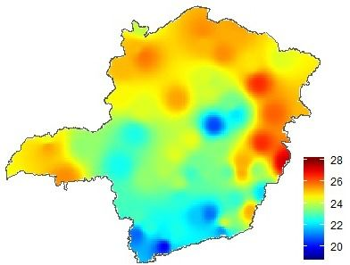
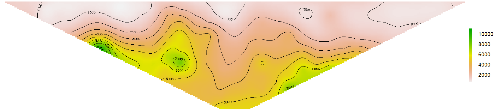
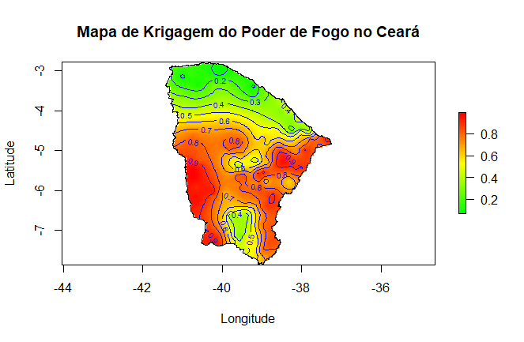
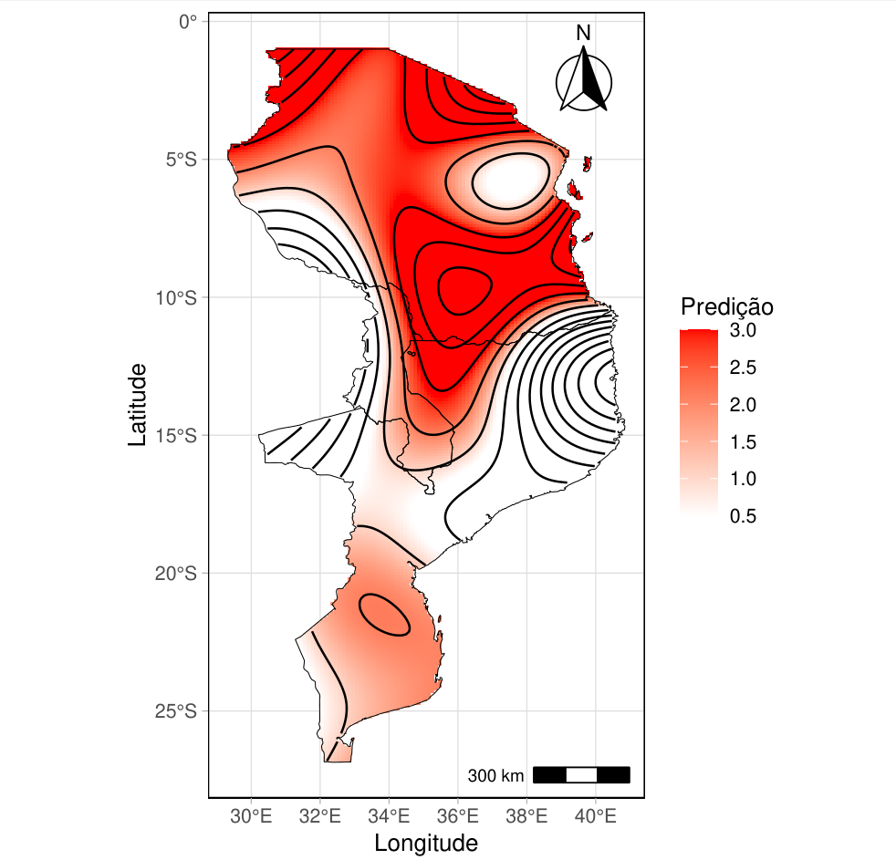
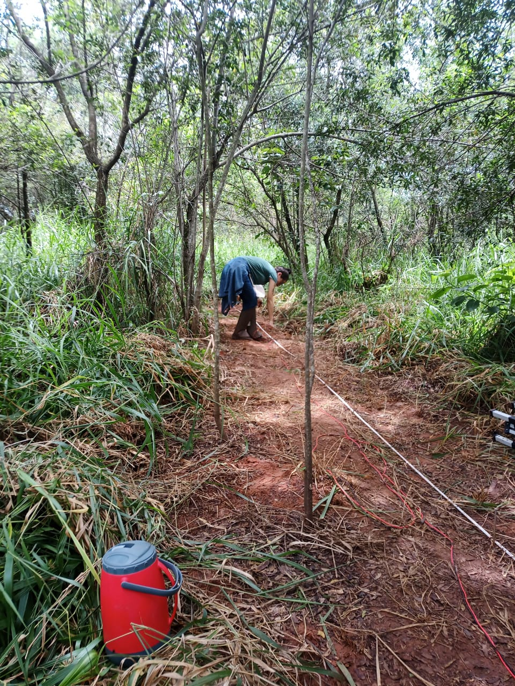

## Geoestatística

::: {.callout-tip title="📌 Mapas de krigagem" style="background-color: #e3f2fd;"}
::: {#fig-mapas-krigagem layout-ncol=2 layout-valign="center"}
{#fig-mg-municipios group="mapas-krigagem"}

{#fig-bh-bairros group="mapas-krigagem"}

{#fig-ceara-municipios group="mapas-krigagem"}

{#fig-mozambique group="mapas-krigagem"}

Exemplos de mapas gerados por krigagem
:::
:::

::: {.callout-note title="📸 Coleta de dados no campo" style="background-color: #f3e5f5;"}
### Coleta dos dados de resistividade do solo em uma fazenda em Minas Gerais - Brasil

::: {#fig-coleta-campo fig-align="center"}
{#fig-vanessa1 width=40%}
:::

:::


## Introdução Teórica

A Geoestatística é a ferramenta que nos permite estudar fenômenos naturais que variam no espaço, como a fertilidade do solo, teores de minérios ou distribuição de chuvas e entre outros.

De acordo com @scalon2024, uma variável geoestatística **Z** é uma variável distribuída em uma superfície contínua cujos valores $z$ (dados geoestatísticos) são considerados realizações de processos estocásticos (função aleatória) indexados no espaço $s$.

O grande diferencial da geoestatística é considerar a **dependência espacial**: observações vizinhas tendem a ser mais parecidas entre si do que observações distantes.

### Etapas de um Estudo Geoestatístico

Neste minicurso, seguiremos os 4 passos essenciais de um estudo geoestatístico:

1. **Análise Exploratória:** Conhecer os dados e visualizar a distribuição espacial.
2. **Variografia:** Medir a continuidade espacial através do Semivariograma.
3. **Ajuste de Modelo:** Encontrar uma equação matemática que descreva essa continuidade.
4. **Krigagem:** Estimar valores em locais não amostrados (geração de mapas).

## Prática: Dados e Análise Exploratória

Vamos utilizar o pacote `geoR`, uma referência na área. Usaremos o conjunto de dados `ca20` (teor de cálcio no solo), que já vem incluído no pacote.

```{r}
# Instalando e carregando o pacote necessário
if(!require(geoR)) install.packages("geoR")
library(geoR)

# Carregando dados de exemplo
data(ca20) 

# Visualização inicial dos pontos e seus valores
# O tamanho do ponto (cex) é proporcional ao valor do Cálcio
points(ca20, main = "Distribuição Espacial das Amostras (Cálcio)", 
       col = "blue", cex.min = 1, cex.max = 3, 
       xlab = "Coord X", ylab = "Coord Y")
```

## Direções para verificar a anisotropia espacial

\begin{figure}[H]
\centering
\begin{tikzpicture}[scale=1.1]

% Eixos
\draw[->] (-5,0) -- (5,0) node[right] {$x$};
\draw[->] (0,-5) -- (0,5) node[above] {$y$};

% Direção 0°
\draw[thick, blue] (-4,0) -- (4,0);
\node[blue, below right] at (4,0) {$0^\circ$};

% Direção 90°
\draw[thick, red] (0,-4) -- (0,4);
\node[red, above left] at (0,4) {$90^\circ$};

% Direção 45°
\draw[thick, green!70!black] (-3,-3) -- (3,3);
\node[green!70!black, above right] at (3,3) {$45^\circ$};

% Direção 135°
\draw[thick, purple] (-3,3) -- (3,-3);
\node[purple, below right] at (3,-3) {$135^\circ$};

% Ponto central (origem)
\fill (0,0) circle (2pt);

\end{tikzpicture}
\caption{Direções básicas utilizadas na construção de semivariogramas direcionais para verificação de anisotropia.}
\end{figure}


## Forma e pararâmetros do Semivariograma típico de dados geoestatísticos com dependência espacial

\begin{figure}[H]
\centering
\begin{tikzpicture}
\begin{axis}[
    width=12cm,
    height=8cm,
    xlabel={Distância ($h$)},
    ylabel={Semivariância $\gamma(h)$},
    xmin=0, xmax=10,
    ymin=0, ymax=6,
    axis lines=left,
    xtick=\empty,
    ytick=\empty,
    domain=0:10,
    samples=100
]

% Curva do semivariograma (modelo esférico)
\addplot[thick, blue] 
{ 
    x < 6 ? 
    0.5 + 4*(1.5*(x/6) - 0.5*(x/6)^3) : 
    4.5
};

% Efeito pepita (C0)
\addplot[dashed] coordinates {(0,0) (0,0.5)};
\node[left] at (axis cs:0,0.25) {$C_0$};

% Patamar (C0 + C)
\addplot[dashed] coordinates {(0,4.5) (10,4.5)};
\node[right] at (axis cs:10,4.5) {Patamar $(C_0 + C)$};

% Alcance (a)
\addplot[dashed] coordinates {(6,0) (6,4.5)};
\node[below] at (axis cs:6,0) {Alcance $(a)$};

% Ponto da pepita
\addplot[only marks, mark=*] coordinates {(0,0.5)};

\end{axis}
\end{tikzpicture}
\caption{Semivariograma típico destacando o efeito pepita, o patamar e o alcance.}
\end{figure}


O Semivariograma

O Semivariograma é o gráfico que quantifica a dependência espacial. Ele relaciona a semivariância ($\gamma$) com a distância ($h$) entre os pontos.

Parâmetros do Semivariograma

A interpretação visual do variograma depende de três parâmetros teóricos:

Efeito Pepita ($C_0$): É a descontinuidade na origem. Representa a variabilidade em distâncias muito curtas ou erros de medição.

Patamar ($C$): É o valor onde o gráfico estabiliza. Representa a variância total dos dados ($C_0 + C_1$).

Alcance ($a$): A distância onde o gráfico atinge o patamar. Amostras separadas por uma distância maior que $a$ não têm mais correlação espacial.

Estimadores: Clássico vs. Robusto
Estimador Clássico de Matheron

É a média dos quadrados das diferenças. É o mais comum, mas sensível a outliers.

$$
2\hat{\gamma}_{M}(h) = \frac{1}{N(h)} \sum_{i=1}^{N(h)} (Z(x_{i}+h) - Z(x_{i}))^{2}
$$

Estimador Robusto de Cressie-Hawkins

Utiliza a raiz quadrada das diferenças para suavizar o impacto de valores extremos.

$$
2\hat{\gamma}_{CH}(h) = \frac{\left[ \frac{1}{N(h)} \sum_{i=1}^{N(h)} |Z(x_{i}+h) - Z(x_{i})|^{1/2} \right]^4}{0.457 + \frac{0.494}{N(h)}}
$$

## Direções para verificar a anisotropia espacial

```{r}
#| label: fig-anisotropia
#| engine: tikz
#| echo: false
#| fig-cap: "Direções básicas utilizadas na construção de semivariogramas direcionais para verificação de anisotropia."
#| fig-align: center

\begin{tikzpicture}[scale=1.1]

% Círculo de referência
\draw[gray, thick] (0,0) circle (4);

% Direção 0°
\draw[<->, thick, blue] (-4,0) -- (4,0);
\node[blue, right] at (4,0) {\textbf{0$^\circ$ (Leste)}};

% Direção 90°
\draw[<->, thick, red] (0,-4) -- (0,4);
\node[red, above] at (0,4) {\textbf{90$^\circ$ (Norte)}};

% Direção 45°
% Coordenadas para raio 4: 4*cos(45) = 2.828
\draw[<->, thick, green!70!black] (-2.828,-2.828) -- (2.828,2.828);
\node[green!70!black, above right] at (2.828,2.828) {\textbf{45$^\circ$ (NE)}};

% Direção 135°
\draw[<->, thick, purple] (-2.828,2.828) -- (2.828,-2.828);
\node[purple, above left] at (-2.828,2.828) {\textbf{135$^\circ$ (NO)}};

% Ponto central (origem)
\fill (0,0) circle (3pt);

\end{tikzpicture}
```

## Forma e parâmetros do Semivariograma típico de dados geoestatísticos com dependência espacial

```{r}
#| label: fig-semivariograma-teorico
#| engine: tikz
#| echo: false
#| fig-cap: "Forma e parâmetros de um semivariograma típico (modelo esférico) com dependência espacial."
#| fig-align: center
#| engine.opts: 
#|   extra.preamble: "\\usepackage{pgfplots}\\pgfplotsset{compat=newest}\\usetikzlibrary{decorations.pathreplacing}"

\begin{tikzpicture}
\begin{axis}[
    width=12cm,
    height=8cm,
    xlabel={Distância ($h$)},
    ylabel={Semivariância $\gamma(h)$},
    xmin=0, xmax=11,
    ymin=0, ymax=6,
    axis lines=left,
    xtick=\empty,
    ytick=\empty,
    domain=0:10,
    samples=100,
    clip=false
]

% Curva do semivariograma (Modelo Esférico)
\addplot[ultra thick, blue] 
{ 
    x < 6 ? 
    0.5 + 4*(1.5*(x/6) - 0.5*(x/6)^3) : 
    4.5
};

% Rótulo do modelo
\node[blue, anchor=south east] at (axis cs:6, 4.5) {Modelo esférico};

% Efeito pepita (C0)
% Chave para Efeito Pepita
\draw[decorate, decoration={brace, amplitude=5pt}, thick] (axis cs:-0.2,0) -- (axis cs:-0.2,0.5) node [midway, left=6pt] {Efeito pepita $(C_0)$};

% Variância estrutural (C)
% Chave para Variância Estrutural
\draw[decorate, decoration={brace, amplitude=5pt}, thick] (axis cs:-0.2,0.5) -- (axis cs:-0.2,4.5) node [midway, left=6pt, align=right] {Variância\\estrutural $(C)$};

% Patamar (C0 + C)
\addplot[gray, dashed] coordinates {(0,4.5) (10.5,4.5)};
\node[right, font=\small] at (axis cs:10.5,4.5) {Patamar $(C_0 + C)$};

% Alcance (a)
\addplot[gray, dashed] coordinates {(6,0) (6,4.5)};
\node[below] at (axis cs:6,0) {Alcance $(a)$};

% Ponto da pepita
\addplot[only marks, mark=*, fill=white] coordinates {(0,0.5)};

\end{axis}
\end{tikzpicture}
```


## Modelos teóricos de Semivariogramas

Em geoestatística, os modelos teóricos de semivariograma são utilizados para descrever a estrutura de dependência espacial de uma variável regionalizada [@teixeira2013]. Esses modelos são ajustados aos semivariogramas experimentais e permitem a aplicação de métodos de interpolação espacial, como a krigagem [@diggle2007model].

Abaixo estão os principais modelos isotrópicos utilizados na literatura.

### Modelo Esférico

O modelo esférico é amplamente utilizado em aplicações geoestatísticas, especialmente em estudos de solos e ciências agrárias [@teixeira2013]. Caracteriza-se por apresentar um comportamento linear na origem e atingir o patamar em uma distância finita, denominada alcance ($a$) [@journel1978].

$$
\gamma(h) =
\begin{cases}
C_0 + C \left[ \frac{3}{2}\left(\frac{h}{a}\right) -
\frac{1}{2}\left(\frac{h}{a}\right)^3 \right], & 0 < h \leq a, \\
C_0 + C, & h > a
\end{cases}
$$

### Modelo Exponencial

O modelo exponencial apresenta crescimento assintótico em relação ao patamar, ou seja, teoricamente não atinge o patamar em uma distância finita. É indicado para fenômenos contínuos, mas com variações abruptas em curtas distâncias. Na prática, considera-se o alcance efetivo ($a_{ef}$) como aproximadamente três vezes o parâmetro de escala ($a_{ef} \approx 3a$) [@diggle2007model].

$$
\gamma(h) = C_0 + C \left[ 1 - \exp\left(-\frac{h}{a}\right) \right]
$$

### Modelo Gaussiano

O modelo gaussiano é indicado para variáveis que apresentam elevada continuidade espacial nas pequenas distâncias, resultando em uma curva suave (parabólica) próxima à origem. Assim como o modelo exponencial, o patamar é atingido de forma assintótica, e o alcance efetivo é aproximadamente $\sqrt{3}$ vezes o parâmetro de escala ($a_{ef} \approx \sqrt{3}a$) [@diggle2007model; @journel1978].

$$
\gamma(h) = C_0 + C \left[ 1 - \exp\left(-\frac{h^2}{a^2}\right) \right]
$$

### Modelo Matérn

O modelo Matérn é uma generalização flexível dos modelos exponencial e gaussiano, permitindo controlar a suavidade do processo espacial por meio do parâmetro $\nu$ (muitas vezes denotado como $\kappa$). Valores menores de $\nu$ (ex: 0.5) indicam processos menos suaves (equivalente ao Exponencial), enquanto valores maiores (ex: $\nu \to \infty$) representam maior continuidade espacial (tendendo ao Gaussiano) [@diggle2007model].

$$
\gamma(h) =
C_0 + C \left[
1 - \frac{1}{2^{\nu-1}\Gamma(\nu)}
\left(\frac{h}{a}\right)^{\nu}
K_{\nu}\left(\frac{h}{a}\right)
\right]
$$

onde $K_{\nu}(\cdot)$ é a função de Bessel modificada de segunda espécie, $\Gamma(\cdot)$ é a função Gama e $\nu > 0$ é o parâmetro de suavidade do modelo.